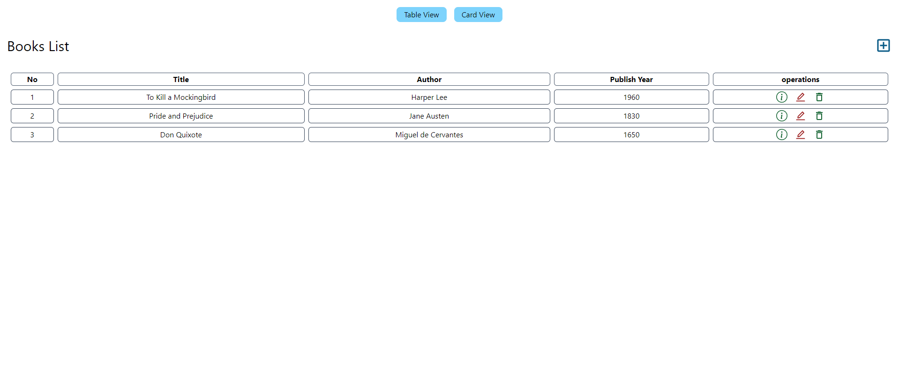
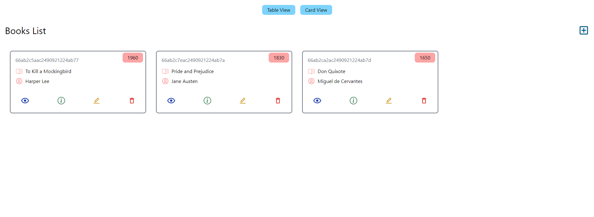
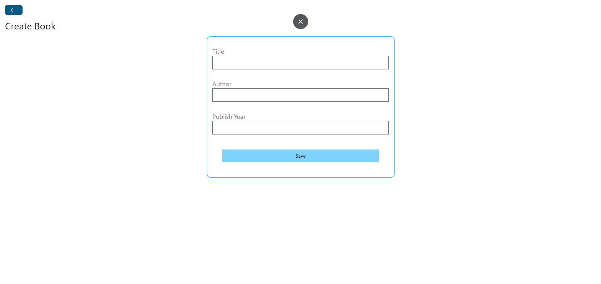
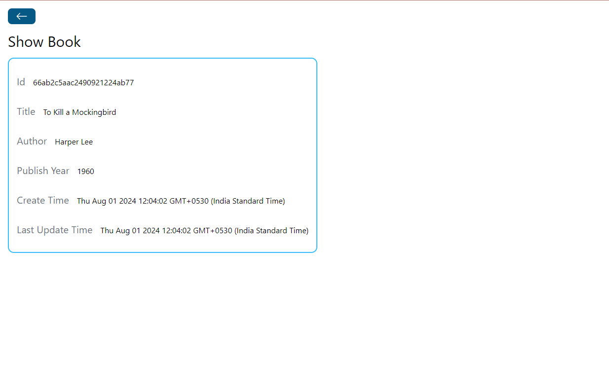
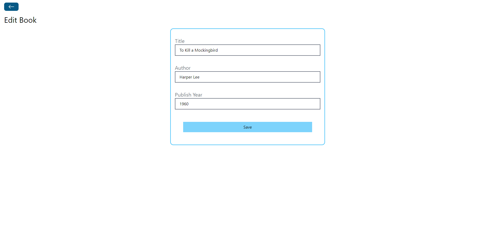

# Book Store Project (MERN Stack)

## Description

The Book Store Project is a straightforward implementation of CRUD (Create, Read, Update, Delete) operations using the MERN (MongoDB, Express.js, React, Node.js) stack. It showcases essential functionalities for managing books on both the backend and frontend, incorporating routing and CORS policy handling.

## Features

- **Backend CRUD:** Offers endpoints for CRUD actions to manage book data effectively.
- **Express.js Routing:**  Organizes routes and controllers separately for better code structure.
- **CORS Policy Configuration:**  Ensures secure cross-origin communication between frontend and backend.
- **MongoDB Integration:** Utilizes MongoDB as the database for storing and handling book records.
- **Frontend CRUD Functionality:**  Provides a user-friendly interface to perform CRUD operations on books.
- **React Router:**Implements client-side routing for seamless navigation within the frontend application.

## Screenshots

## Technologies Used
### Backend:
- Node.js
- Express.js
- MongoDB

### Frontend:

- Vite
- React